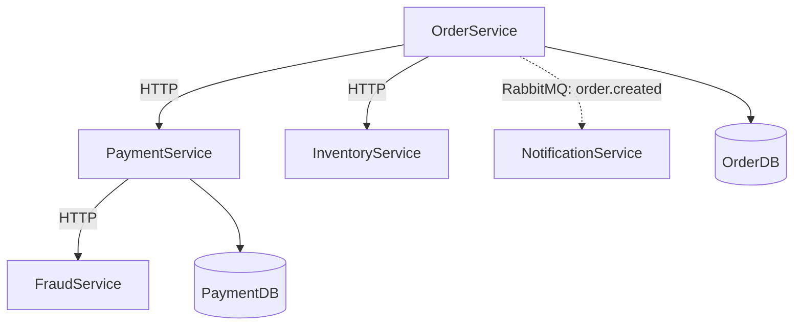

# Claude Code — Semana 3
> Guia de referência: CLAUDE.md e contexto de projeto

---

## O que é o CLAUDE.md

Arquivo na raiz do projeto que o Claude Code lê no início de cada sessão.
Transforma o Claude Code de uma ferramenta genérica em um assistente que
conhece o seu projeto — convenções, padrões, regras de negócio e checklists.

---

## Fluxo para projeto desconhecido

### Passo 1 — Abrir o Claude Code na raiz do projeto

```bash
cd seu-projeto
claude
```

### Passo 2 — Pedir um mapa geral

```
Explore toda a estrutura do projeto e me dê:
1. O que esse sistema faz?
2. Quais são as principais tecnologias usadas?
3. Quais são os módulos ou serviços existentes?
4. Existe algum padrão arquitetural identificável?
```

### Passo 3 — Aprofundar nos fluxos de negócio

```
Quais são os fluxos de negócio principais?
Trace o caminho de uma requisição desde o endpoint
até a resposta, passando por todas as camadas.
```

### Passo 4 — Identificar riscos e dívidas técnicas

```
Analisando o código, quais são os pontos de atenção?
Existe código sem testes, lógica duplicada,
ou responsabilidades misturadas?
```

### Passo 5 — Gerar o CLAUDE.md (primeira rodada)

```
Com base em tudo que analisou, gere um CLAUDE.md
completo que serviria como onboarding para um
desenvolvedor novo nesse projeto, contendo:
1. Visão geral do projeto e seu propósito
2. Estrutura de pastas explicada
3. Padrões de código identificados
4. Regras de negócio do domínio
5. Convenções de teste (framework, nomenclatura usada)
6. Comandos úteis (build, test, run)
```

---

## Segunda rodada — Enriquecer o CLAUDE.md

> Esta etapa adiciona o contexto humano que o Claude Code não consegue inferir sozinho.

```
Revise o CLAUDE.md gerado e adicione as seguintes seções:

1. Checklist de qualidade antes de todo commit:
   - Testes passando (dotnet test)
   - Sem validações de domínio faltando
   - Nomes de métodos e classes expressivos
   - Sem lógica de negócio em controllers

2. Decisões arquiteturais tomadas e o porquê:
   - Por que usamos essa estrutura de pastas?
   - Por que xUnit e não NUnit?
   - Quais padrões devem ser seguidos obrigatoriamente?

3. O que NÃO fazer nesse projeto:
   - Exemplos de anti-patterns identificados
   - Regras que não devem ser quebradas

4. Contexto de negócio que o código não explica:
   - Quais regras de negócio são críticas?
   - Quais fluxos têm mais impacto se quebrarem?
```

---

## Validação do CLAUDE.md

> Use esse prompt para testar se o CLAUDE.md está completo o suficiente para guiar trabalho real.

```
Com base no CLAUDE.md, se eu precisar adicionar
um novo caso de uso "[nome do caso de uso]",
por onde você começaria e quais arquivos seriam alterados?
```

### O que observar na resposta

| Sinal | Significa |
|---|---|
| Plano de implementação estruturado | CLAUDE.md está bem documentado |
| Devolve decisão não técnica para o negócio | Contexto de domínio foi absorvido |
| Antecipa testes sem você pedir | Convenções de teste estão claras |

---

## O loop de melhoria contínua

```
Bom CLAUDE.md
      ↓
Claude Code entende o domínio
      ↓
Respostas com contexto de negócio
      ↓
Você documenta mais no CLAUDE.md
      ↓
Claude Code fica ainda melhor
```

---

## Resultado da Semana 3

- ✅ CLAUDE.md gerado com contexto completo
- ✅ Checklist de qualidade documentado
- ✅ Decisões arquiteturais registradas
- ✅ Regras de negócio explicitadas
- ➡️ Próximo: MCP e automações (Semana 4)

---

# Claude Code — Semana 4
> Guia de referência: MCP e automações

---

## O que é MCP

Model Context Protocol — padrão aberto que conecta o Claude Code a ferramentas
externas como Azure DevOps, GitHub, Jira, Notion e Sentry, sem integrações manuais.
Pense como o "USB-C para IA": um adaptador universal para qualquer sistema.

---

## Configurando o MCP do Azure DevOps

### Passo 1 — Gerar o PAT no Azure DevOps

1. Acesse `https://dev.azure.com/SUA_ORG`
2. Clique no avatar → **Personal Access Tokens**
3. Crie um token com as permissões:
   - Work Items: Read & Write
   - Code: Read & Write
   - Build: Read
   - Release: Read

### Passo 2 — Instalar o MCP oficial da Microsoft

```bash
claude mcp add azure-devops -- npx -y @azure-devops/mcp SUA_ORG
```

> Substitua `SUA_ORG` pelo nome da sua organização no Azure DevOps.

### Passo 3 — Verificar conexão

```bash
# No terminal
claude mcp list

# Dentro de uma sessão Claude Code
/mcp
```

Deve aparecer `azure-devops (connected)`.

---

## Prompts do dia a dia com Azure DevOps

### Work Items e Sprint

```
Liste todos os work items ativos da sprint atual
atribuídos a mim.
```

```
Crie um bug: "Pedido criado sem validação de customerId"
com prioridade alta na sprint atual.
```

### Pull Requests

```
Mostre os últimos PRs abertos no repositório OrderService
e quem está pendente de revisão.
```

### Rastreabilidade

```
Trace o commit abc1234 — em qual PR, build
e release ele passou?
```

```
O que foi entregue na última release do pipeline
de produção? Mostre cada commit e work item.
```

---

## Mapa de conexões entre microsserviços

> Esse fluxo resolve a dor de entender como os serviços se conectam.

### Prompt de preparação

```
Analise todos os repositórios do projeto no Azure DevOps
e mapeie todas as conexões entre eles: chamadas HTTP,
filas de mensageria, bancos de dados e dependências externas.
Guarde esse contexto pois vou pedir um diagrama em seguida.
```

```
OU Prompt de preparação — a partir de uma aplicação:

Analise o repositório [NomeDaAplicacao] no Azure DevOps
e mapeie todas as conexões a partir dele: quais serviços
ele chama via HTTP, quais filas publica ou consome,
quais bancos de dados acessa e quais dependências externas utiliza.
Se encontrar dependências, analise um nível a mais — ou seja,
o que essas dependências também consomem.
Guarde esse contexto pois vou pedir um diagrama em seguida.
```

```
OU Prompt de preparação — múltiplas aplicações selecionadas:
Analise os seguintes repositórios no Azure DevOps:
- [NomeDaAplicacao1]
- [NomeDaAplicacao2]
- [NomeDaAplicacao3]

Para cada um mapeie: chamadas HTTP, filas de mensageria,
bancos de dados e dependências externas.
Foque especialmente nas conexões que existem ENTRE
essas aplicações listadas.
Se encontrar dependências fora dessa lista, inclua
no mapa mas sinalize visualmente como externas.
Guarde esse contexto pois vou pedir um diagrama em seguida.
```


### Prompt do mapa (rode logo após)

```
Com base na análise feita, gere um diagrama Mermaid
completo das conexões entre os serviços, seguindo essas regras:
- Serviços como nós retangulares
- Chamadas HTTP como setas sólidas com o endpoint →
- Mensageria como setas tracejadas com o nome da fila -->
- Bancos de dados como cilindros [(NomeDB)]
- Serviços externos como nós com borda dupla ((Nome))
- Agrupe por domínio de negócio quando possível
```

### Exemplo de saída esperada



### Prompt de fluxo de negócio (após o mapa)

```
Com base no mapa de conexões gerado, trace o caminho
completo de uma ordem desde a criação até a confirmação
de pagamento, passando por todos os serviços envolvidos.
Identifique onde podem existir pontos de falha.
```

### Salvar no CLAUDE.md

```
Atualize o CLAUDE.md com o mapa de conexões
gerado e os fluxos de negócio identificados.
```

---

## MCPs úteis para o contexto .NET

| MCP | Para quê | Comando de instalação |
|---|---|---|
| Azure DevOps | PRs, work items, pipelines | `claude mcp add azure-devops -- npx -y @azure-devops/mcp SUA_ORG` |
| GitHub | Repos, issues, commits | `claude mcp add github -- npx -y @modelcontextprotocol/server-github` |
| Sentry | Erros de produção | `claude mcp add sentry -- npx -y @modelcontextprotocol/server-sentry` |
| Notion | Documentação do time | `claude mcp add notion -- npx -y @modelcontextprotocol/server-notion` |

---

## Resultado da Semana 4

- ✅ MCP Azure DevOps configurado
- ✅ Prompts de work items, PRs e rastreabilidade
- ✅ Mapa de conexões entre microsserviços gerado
- ➡️ Próximo: Skills e Routines (Semana 5)

---

# Claude Code — Semana 5 (prévia)
> Skills e Routines: automações reutilizáveis

---

## O que são Skills

Skills são workflows reutilizáveis salvos em arquivos Markdown dentro do projeto.
Você define uma vez e chama sempre que precisar — como funções, mas para o Claude Code.

**Exemplo:** em vez de digitar um prompt longo toda vez para gerar testes,
você cria uma skill `generate-tests` e chama com:

```
/generate-tests Order.cs
```

### Onde ficam

```
.claude/
  skills/
    generate-tests.md
    review-pr.md
    map-services.md
```

---

## O que são Routines

Routines são sequências de ações que o Claude Code executa automaticamente
em resposta a eventos — como hooks que rodam antes ou depois de uma ação.

**Exemplos:**
- Antes de todo commit → rodar testes e verificar checklist do CLAUDE.md
- Após criar um PR → gerar descrição automática e linkar work item no Azure DevOps
- Ao abrir o projeto → exibir resumo do que está em andamento na sprint

---

## Por que isso importa para você

| Situação | Sem Skills/Routines | Com Skills/Routines |
|---|---|---|
| Gerar testes | Digitar prompt longo toda vez | `/generate-tests NomeClasse.cs` |
| Revisar PR | Processo manual | Routine automática ao abrir PR |
| Mapa de serviços | Rodar 3 prompts em sequência | `/map-services` |
| Checklist de commit | Lembrar manualmente | Routine automática pré-commit |

---

> ℹ️ A Semana 5 será detalhada na próxima sessão de estudos.

---

# Trilha Completa — Claude Code
> Visão geral de todas as features e ordem de aprendizado

---

## Linha do tempo das features

| Feature | Lançamento | O que resolve |
|---|---|---|
| **MCP** | Nov 2024 | Conectar ferramentas externas |
| **Subagents** | Jul 2025 | Workers paralelos e isolados |
| **Hooks** | Set 2025 | Automação por eventos do ciclo de vida |
| **Plugins** | Out 2025 | Extensões empacotadas para o time |
| **Skills** | Out 2025 | Workflows reutilizáveis como slash commands |
| **Agent Teams** | Fev 2026 | Orquestração de múltiplos agentes |

---

## Mapa de aprendizado

| Semana | Feature | Por quê essa ordem |
|---|---|---|
| ✅ 1 | Exploração básica | Base — entender o ambiente |
| ✅ 2 | Testes e refatoração | Prática real com código |
| ✅ 3 | CLAUDE.md | Contexto persistente do projeto |
| ✅ 4 | MCP (Azure DevOps) | Conectar ferramentas do dia a dia |
| 5 | Skills | Workflows reutilizáveis |
| 6 | Hooks | Automação por eventos |
| 7 | Subagents | Paralelismo e isolamento de contexto |
| 8 | Plugins | Empacotamento para o time |
| 9 | Agent Teams | Orquestração avançada de agentes |

---

## Prévia das Semanas 6 a 9

### Semana 6 — Hooks

Hooks são scripts event-driven que disparam automaticamente em momentos
específicos do ciclo de vida do Claude Code — sem você precisar pedir.

**Eventos mais úteis:**

| Evento | Quando dispara | Uso prático |
|---|---|---|
| `UserPromptSubmit` | Ao submeter um prompt | Modificar ou bloquear o prompt |
| `PreToolUse` | Antes de qualquer ferramenta | Checkpoint de segurança |
| `PostToolUse` | Após executar uma ferramenta | Rodar linter, logar resultado |
| `Stop` | Ao finalizar uma tarefa | Notificação no desktop |
| `SessionStart` | Ao abrir uma sessão | Carregar contexto do dia |
| `PreCompact` | Antes de compactar contexto | Fazer backup do transcript |

**Exemplo prático:** notificação ao terminar uma tarefa longa:
```bash
# ~/.claude/hooks/notify-on-stop.sh
notify-send "Claude Code" "Tarefa finalizada!"
```

---

### Semana 7 — Subagents

Subagents são instâncias especializadas do Claude Code que rodam tarefas
em paralelo, cada uma com seu próprio contexto isolado — sem poluir
a sessão principal.

**Quando usar:**
- Analisar múltiplos microsserviços ao mesmo tempo
- Rodar pesquisa em paralelo com implementação
- Delegar tarefas repetitivas enquanto você foca no principal

**Exemplo prático:**
```
Crie um subagent para analisar o OrderService
e outro para analisar o PaymentService em paralelo.
Ao terminar, consolide os resultados e me mostre
as dependências entre eles.
```

---

### Semana 8 — Plugins

Plugins empacotam Skills e MCPs juntos para distribuição no time.
Você cria uma vez, o time inteiro instala com um comando.

**Caso de uso:** criar um plugin `dotnet-quality` com:
- Skill `/generate-tests`
- Skill `/review-pr`
- Skill `/map-services`
- Hook de checklist pré-commit

---

### Semana 9 — Agent Teams

Agent Teams orquestram múltiplos agentes trabalhando juntos em tarefas
complexas, com pouca intervenção humana.

**Exemplo prático no seu contexto:**
```
Monte um agent team para:
1. Analisar todos os microsserviços do projeto
2. Gerar o mapa de conexões
3. Identificar pontos de falha
4. Criar work items no Azure DevOps para cada problema encontrado
5. Gerar relatório consolidado
```

---

> ℹ️ Cada semana será detalhada na sessão de estudos correspondente.
