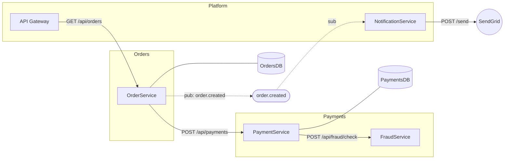

Leia o arquivo `service-map.json` na raiz do workspace e gere um diagrama Mermaid completo das conexões entre os serviços.

## Regras de geração do diagrama

**Nós por tipo:**
- Serviços → retângulos: `OrderService[OrderService]`
- Bancos de dados → cilindros: `OrdersDB[(OrdersDB)]`
- Filas → retângulos arredondados: `order_created([order.created])`
- Serviços externos → nós com borda dupla: `SendGrid((SendGrid))`

**Arestas por tipo de conexão:**
- HTTP outbound → seta sólida com endpoint: `OrderService -->|POST /api/payments| PaymentService`
- Queue publish → seta tracejada com nome da fila: `OrderService -.->|pub: order.created| order_created`
- Queue consume → seta tracejada invertida: `order_created -.->|sub| NotificationService`
- Database → seta sólida sem label: `OrderService --- OrdersDB`

**Agrupamento por domínio:**
Agrupe serviços em `subgraph` pelo campo `domain` do service-map.json:
```
subgraph Orders
  OrderService
end
subgraph Payments
  PaymentService
  FraudService
end
```

## Formato de saída

Gere o diagrama como bloco de código Mermaid e também salve em `diagram.mmd` na raiz do workspace.

Exemplo de estrutura esperada:



## Regras adicionais

- IDs dos nós sem espaços nem caracteres especiais (usar underscore)
- Se um serviço não tiver domínio definido, agrupar em `subgraph Other`
- Omitir conexões com `target` não encontrado em nenhuma seção do JSON
- Limite de legibilidade: se o diagrama tiver mais de 30 nós, gerar versões separadas por domínio
- Exibir o diagrama no chat e confirmar o caminho do `diagram.mmd` salvo
